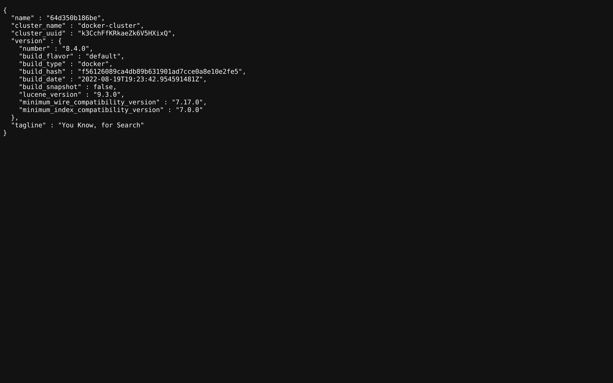
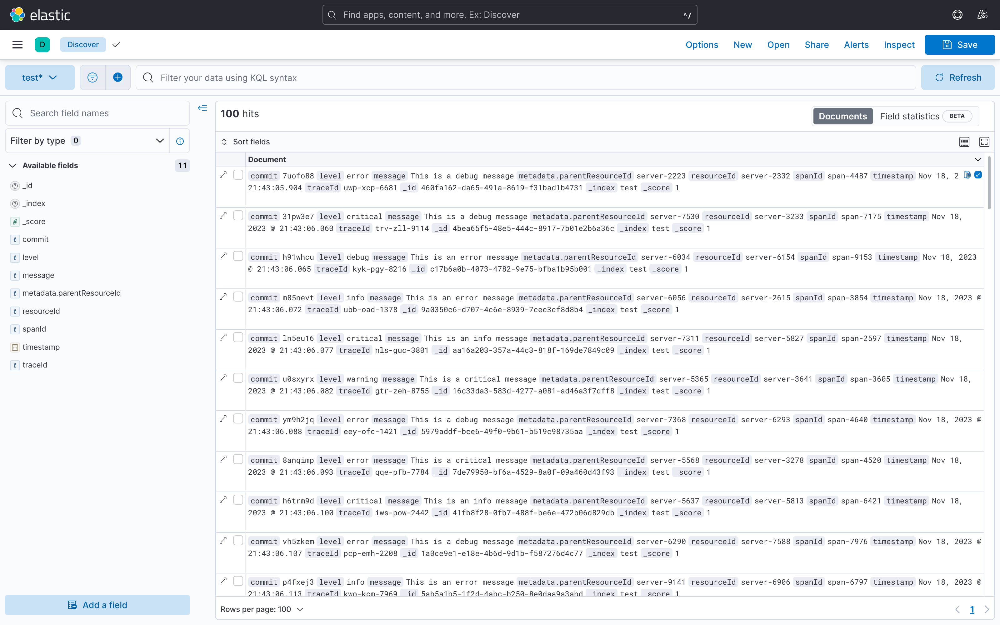

# Log Ingestor and Query System


## About The Project

This project implements a log ingestor that can efficiently handle large volumes of log data, and a simple interface for querying the ingested logs.

## Features

-   Log ingestor that accepts log data over HTTP on port 3000
-   Storage engine that can scale to handle vast log volumes
-   Query interface with full-text search and field filters

## Screenshots

- **Elastic Search**
  
- **Kibana**
  


## Built With

- FastAPI
- Docker
- Elasticsearch
- Kibana

## Getting Started

This is an example of how you may give instructions on setting up your project locally.

### Prerequisite
-   Python 3.8+
-   Docker


### Installation

1. Clone the repo
```bash
git clone https://github.com/Arvind-4/python-logs.git .
```
2. Copy contents of `.sample.env` to `.env`.
```bash
cp .sample.env .env 
```
3. Run the docker file
```bash
docker compose up --build 
```

### Populate the Data

To populate sample log data:

-   Start Elasticsearch and Kibana
-   Run  `data/dump_data.py`  to load sample logs
-   The script sends logs to the ingestor API endpoint

## Usage

The log ingestor stack consists of:

-   **Kibana**  - Query interface and log visualization, runs on port 5601
-   **Elasticsearch**  - Storage engine for logs, runs on port 9200
-   **Log ingestor**  - Backend service to ingest logs, runs on port 3000

Logs are ingested by sending a **POST** request to the ingestor API endpoint:

```bash
curl  --header  "Content-Type: application/json"  \
--request  POST  \
--data  '{ "level": "error", "message": "Failed to connect to DB", "resourceId": "server-1234", "timestamp": "2023-09-15T08:00:00Z","traceId": "abc-xyz-124", "spanId": "span-456", "commit": "5e5342f", "metadata": {"parentResourceId": "server-0987"}}'  \
http://0.0.0.0:3000/api/v1/insert
```

The ingestor stores the logs in Elasticsearch for querying.

The Kibana interface allows searching the logged data via:

-   Full text search across all fields
-   Filtering by specific log fields

Visualizations and dashboards can also be built in Kibana to analyze the log data.

## License

Distributed under the MIT License. See `LICENSE.md` for more information.
